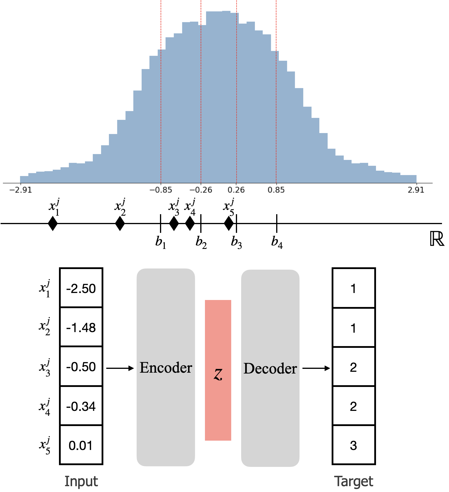

# Binning as a Pretext Task: Improving Self-Supervised Learning in Tabular Domains (ICML 2024)
The implementation codes of the paper *"Binning as a Pretext Task: Improving Self-Supervised Learning in Tabular Domains"* 
(Paper URL: https://arxiv.org/pdf/2405.07414)

## Table of Contents
- [Overview](#overview)
- [Required libraries](#required-libraries)
- [Examples](#examples)
- [License](#license)
- [Contact](#contact)

## Overview
We propose a novel pretext task based on the classical *binning* method for auto-encoding-based self-supervised learning (SSL) in tabular domains. Our approach is straightforward: *reconstructing bin indices* rather than reconstructing the raw values, as illustrated in the Figure.
<p align="center">

</p>
    
Once numerical features are discretized into bins based on the quantiles of the training dataset, we optimize the encoder and decoder networks to accurately predict the bin indices given original inputs. Despite its simplicity, binning as a pretext task offers several advantages for tabular deep learning. By setting the discretized bins as targets for the pretext task, we can employ the inductive bias of capturing the irregular functions and mitigating the discrepancy between features. The binning procedure allows grouping the nearby samples based on the distribution of the training dataset, so the learned representations should be robust to the minor errors that can yield spurious patterns. It also facilitates standardizing all features into equal sets, thereby preventing any uninformative features from dominating during SSL. Furthermore, our approach is compatible with any other modifications, including the choice of deep architectures and input transformation functions.

## Required libraries
Our project has been built on Python 3.9. Here is the entire list of python libraries required (also available in `requirements.txt`):

``` swift
torch==2.0.1
libzero==0.0.4
torchvision==0.15.2
pyaml==6.0.1
argparse==1.1
scikit-learn==1.2.2
scipy==1.10.1
rtdl==0.0.13
numpy==1.26.0
pandas==2.1.1
tqdm==4.66.1
```

### Examples
Here we provide the simple examples in step by step.
1. Clone the repository:
    ```sh
    git clone https://github.com/kyungeun.lee/tabularbinning.git
    ```
2. Navigate to the project directory:
    ```sh
    cd tabularbinning
    ```
3. Install dependencies:
    ```sh
    pip install -r requirements.txt
    ```
4. Set the experimental parameters in `config.yaml`.
5. Implement SSL (Unsupervised setup):
    ```sh
    python main_ssl.py
    ```
**RESULTS**
- Training log file in `logs.log` in the predetermined `savepath`.
- Trained weights of the encoder network into `model_encoder_ep[TARGET_EPOCH}.pt` file in the predetermined `savepath`.
6. Evaluate the learned representations:
- Linear evaluation:
    ```sh
    python main_eval.py --finetuning 0 --wt_path results/CH/model_encoder_ep1000.pt
    ```
- Fine-tuning:
    ```sh
    python main_eval.py --finetuning 1 --wt_path results/CH/model_encoder_ep1000.pt
    ```
**RESULTS**
- Training log file in `logs.log` in the predetermined `savepath`.

### License
Apache-2.0 license

### Contact
Kyungeun Lee (e-mail: kyungeun.lee@lgresearch.ai)
